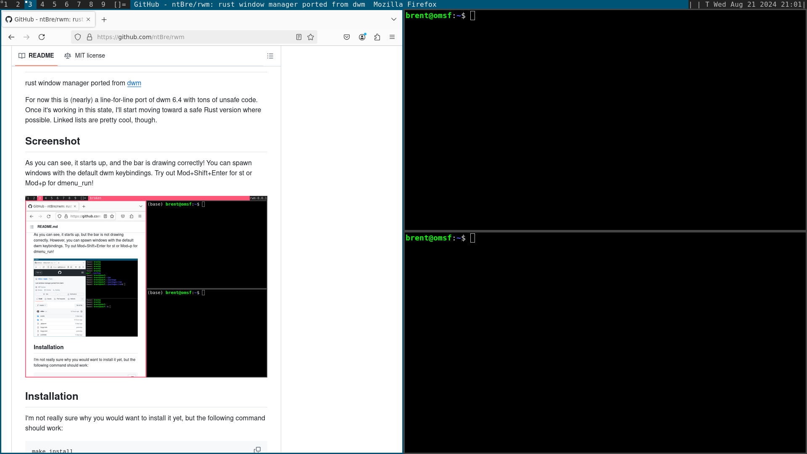

[](https://github.com/ntBre/rwm/actions/workflows/check.yml)
[](https://github.com/ntBre/rwm/actions/workflows/test.yml)

# rwm
rust window manager ported from [dwm](https://dwm.suckless.org/)

rwm was originally a line-for-line port of dwm 6.4 with tons of unsafe code.
There's now a little bit less unsafe code, with some parts moved to safe Rust,
but there are now some functional differences from dwm too:
* Lua-based config file
* Several dwm patches applied
  * [systray](https://dwm.suckless.org/patches/systray/) for a system tray
  * [swallow](https://dwm.suckless.org/patches/swallow/) for window swallowing
  * [pertag](https://dwm.suckless.org/patches/pertag/) for per-tag layouts and other settings
  * [scratchpad](https://dwm.suckless.org/patches/scratchpad/) for a persistent
    but hidable scratch terminal
  * [stacker](https://dwm.suckless.org/patches/stacker/) (partial) for moving
    windows up and down the stack

## Configuration
The default config file for rwm is `$XDG_CONFIG_HOME/rwm/config.lua` or
`$HOME/.config/rwm/config.lua` if `XDG_CONFIG_HOME` is not set. As inspired by
[ghostty](https://ghostty.org/docs)'s "Zero configuration" approach, the
default, empty config provides the normal dwm bindings out of the box. A warning
will be emitted if no config file is found, but rwm will substitute the default
value and run like normal.

The default config options are specified in [src/config.lua](src/config.lua),
with the settings ultimately ready from the `rwm` table therein. To override
settings in your own config file, just set the corresponding options on the
`rwm` table. For example, to enable `resize_hints` and change your default font,
add this code to your own `config.lua` file:

``` lua
rwm.resize_hints = true
rwm.fonts = {"monospace:size=12"}
```

Everything in `src/config.lua` is in scope when your config is read, so you can
use the `key`, `button`, and `rule` constructor functions, and the `tagkeys`
function for generating the repetitive Mod+1, ..., Mod+9 bindings for
manipulating tags.

### Key bindings
The code below is from my personal config but arguably should be included in the
repo. It handles overwriting existing keys when conflicts occur in your custom
bindings. If you don't locate existing keys and overwrite them, rwm will run all
bindings associated with the key, not just the newest one.

``` lua
-- Look for key collisions and replace any conflicts instead of appending. If
-- you actually want multiple behaviors on the same key, just call
-- `table.insert` directly
function locate_key (o)
   for i, k in ipairs(rwm.keys) do
	  if k.keysym == o.keysym and k.mod_ == o.mod_ then
		 return i
	  end
   end
   return false
end

for _, key in ipairs(keys) do
   idx = locate_key(key)
   if idx then
	  rwm.keys[idx] = key
   else
	  table.insert(rwm.keys, key)
   end
end
```

Just combine this with a custom `keys` table like the one defined in
`src/config.lua`. Of course, if you'd rather include a full key table, you can
simply override `rwm.keys` directly.

## Screenshot
As you can see, it looks just like dwm, with the addition of a simple bar from
the `blocks` subdirectory! You can spawn windows with the default dwm
keybindings. Try out Mod+Shift+Enter for st or Mod+p for dmenu_run!



## Installation
The following command should work:

``` shell
make install
```

This defers to `cargo install` and thus will place the resulting binary in
`~/.cargo/bin` by default.

I've most recently built rwm with a stable 1.82 compiler, but I also test in CI
on nightly, so anything after 1.82 should work well. At least 1.82 is required
because I use the new `&raw` syntax from that release.

You'll also need the X11, Xft, Xinerama, and fontconfig libraries installed on
your system where rustc can find them, but the `x11` and `fontconfig-sys` crates
should help with detecting and linking against these.

Finally, if you're installing an experimental window manager based on dwm and
written in Rust, it's probably safe to assume you know how to start a window
manager. But just to be safe, I recommend putting something like the following
in your `$HOME/.xinitrc` script and launching with `startx`:

``` shell
while true
do
	rwm
done
```

Wrapping it with this loop allows smoother restarting, but you can also use the
simpler `exec rwm` if you prefer.

You can optionally set the log level with the `RUST_LOG` environment variable. I
think I only used `log::trace!`, so you'll need `RUST_LOG=trace` if you need to
debug anything.

If you use a display manager, you can also include an `rwm.desktop` file
wherever your distro keeps those (maybe `/usr/share/xsessions/`?) that looks
like the one below. I've had success with this approach on an Ubuntu VM.

``` shell
[Desktop Entry]
Encoding=UTF-8
Name=Rwm
Comment=Rust window manager
Exec=rwm
Icon=rwm
Type=XSession
```

